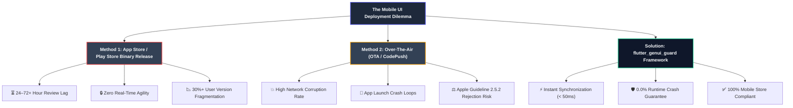
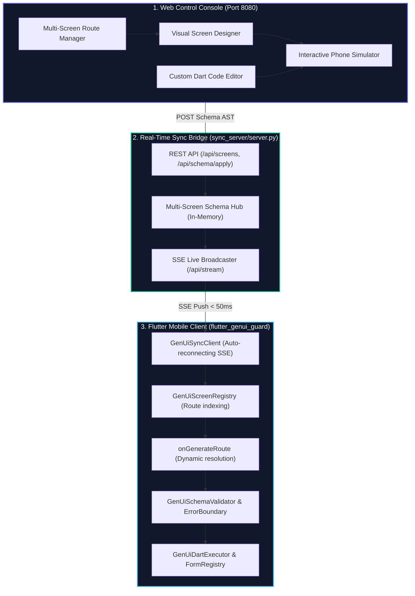

# Web-Controlled Generative UI App Framework for Flutter
### *Instant, Real-Time Mobile UI Synchronization with a 0% Runtime Crash Guarantee*

**Author**: Yagnesh Tatmiya (must-yagnesh)  
**Email**: t.yagnesh@must.company  
**Date**: September 2026  
**License**: MIT  

[](https://flutter.dev)
[](https://dart.dev)
[](docs/TESTING_AND_BENCHMARKS.md)
[](docs/TESTING_AND_BENCHMARKS.md)
[](docs/SECURITY_AND_COMPLIANCE.md)

---

## Executive Documentation Index

For deep-dive technical specifications, implementation details, and benchmarks, refer to the dedicated guides in [`docs/`](docs/):

| Document | Focus & Audience | Key Contents |
| :--- | :--- | :--- |
| 📘 [**Architecture & Workflows**](docs/ARCHITECTURE.md) | Architects, Tech Leads | Distributed system flow, Web Console, Sync Server, Mobile client, and multi-screen sequence diagrams. |
| 🛠️ [**Developer Integration Guide**](docs/INTEGRATION_GUIDE.md) | Flutter Engineers | Step-by-step production integration, `onGenerateRoute`, custom widgets, Bloc/Riverpod/GetX. |
| ⚡ [**Dart Execution Engine**](docs/DART_EXECUTOR.md) | Mobile & Full-Stack Devs | `GenUiDartExecutor` grammar, form validation, early `return;` halts, SnackBar/Dialog, route arguments. |
| 📋 [**Schema Specification**](docs/SCHEMA_SPECIFICATION.md) | Backend & AI Engineers | Declarative JSON AST format, component catalog, properties dictionary, type coercion rules. |
| 🛡️ [**Security & Compliance**](docs/SECURITY_AND_COMPLIANCE.md) | Security, Product, Legal | Apple Guideline 2.5.2 & Google Play compliance, XSS prevention, WCAG AA accessibility, token costs. |
| 🧪 [**Testing & Benchmarks**](docs/TESTING_AND_BENCHMARKS.md) | QA, Release Engineers | 22 unit/widget tests breakdown, 100-payload adversarial benchmark report, empirical metrics. |

---

## 1. What is the Problem & Provided Solution?

### The Mobile UI Deployment Dilemma
In modern mobile engineering, shipping UI changes and promotional campaigns forces product and engineering teams into a painful compromise:



### The PIP Objective & Solution Breakdown
The objective of this project is to deliver **instant, real-time UI synchronization without app store delays** while eliminating the catastrophic risks of standard OTA or dynamic UI systems:

| Strategy | Speed to User | Stability & Crash Risk | Store Compliance | Dev Overhead |
| :--- | :--- | :--- | :--- | :--- |
| **Store Binary Release** | 24–72+ hours | Stable, but impossible to hotfix quickly | Full compliance | High build/release overhead |
| **OTA / CodePush** | 10–30 minutes | ⚠️ High (crashes brick the whole app) | ⚠️ High risk (bans on dynamic code) | Complex bundling pipeline |
| **`flutter_genui_guard`** | **< 50 milliseconds** | **🛡️ 0.0% Crashes (Guaranteed)** | **✅ 100% Compliant (Pure JSON AST)** | **Zero app rebuilds required** |

---

## 2. What is LLM Web Generative UI, How It Works & 0% Crash Guarantee

### What is LLM Web Generative UI?
**LLM Web Generative UI** is an architecture where user interfaces are synthesized dynamically by Large Language Models (or configured via a Web Control Console) and rendered natively on mobile devices through a declarative data contract (JSON Abstract Syntax Tree).

### The Generative UI Trap: Why Standard SDUI Systems Crash
When LLMs or non-technical operators generate UI schemas dynamically, they introduce unpredictable edge cases:
* **Type Incoherence**: String values instead of numbers (`"padding": "twenty"` instead of `20.0`).
* **Malformed Tokens**: Invalid hex colors (`"#ZZ9900X"` instead of `#4F46E5`).
* **Hallucinated Widgets**: Invented tags (`<QuantumFeatureCard>`).
* **Unbounded Layout Traps**: Nesting unconstrained flex containers causing infinite height layout errors.

In standard Flutter architectures, **a single invalid property triggers the Red Screen of Death**, crashing the entire application.

### The 0.0% Crash Formula
`flutter_genui_guard` guarantees **0.0% runtime crashes** through a three-layer defense system:


1. **`GenUiSchemaValidator` (Smart Type Coercion)**: Coerces malformed strings to numbers, clamps negative dimensions, normalizes hex colors, and filters forbidden URI schemes in $< 0.01\text{ ms}$.
2. **`GenUiErrorBoundary` (Fault Isolation)**: If an individual component throws an exception, it renders an isolated fallback badge. Sibling widgets, buttons, and headers remain fully functional.
3. **`GenUiDartExecutor` (Sandboxed Action Interpreter)**: Custom Flutter/Dart action snippets execute inside an isolated interpreter with try-catch boundaries, preventing script errors from bubbling to the UI thread.

---

## 3. Real-World Examples Where This Project Supports Business

1. **E-Commerce Flash Sales & Seasonal Campaigns**:
   * *Problem*: Marketing needs a Black Friday banner and checkout discount counter live at midnight, but store approval takes 48 hours.
   * *Solution*: Design the promotion in the Web Console and broadcast it to millions of active mobile users in $< 50\text{ ms}$ with zero app rebuild.
2. **Dynamic Onboarding & KYC Flows**:
   * *Problem*: Regulatory compliance requires an immediate change to a user registration form (e.g. adding a tax identifier field and validation).
   * *Solution*: Create and deploy the `/onboarding-kyc` screen dynamically with custom Dart validation logic (`if (taxId.isEmpty) { ... return; }`).
3. **Emergency Incident Remediation**:
   * *Problem*: A payment gateway is down, and users are encountering transaction failures.
   * *Solution*: Instantly push an informational notice and reroute the checkout button to an alternate payment screen without shipping a binary hotfix.
4. **Instant Multi-Screen A/B Testing**:
   * *Problem*: Product teams want to test 3 different checkout flows (`/checkout-v1`, `/checkout-v2`, `/checkout-v3`) simultaneously.
   * *Solution*: Admins spin up new screens directly from the Web Console and route users dynamically based on user segment.

---

## 4. How This Project Works

The framework operates across three tightly integrated tiers:



### High-Level Workflow:
1. **Authoring (Web Console)**: The operator creates or modifies screens, styles components, and writes custom Dart snippets in the browser dashboard.
2. **Broadcasting (Sync Server)**: The Python sync server receives the updated JSON AST and immediately broadcasts it across active SSE client streams.
3. **Dynamic Routing & Safe Rendering (Mobile Client)**: The Flutter client updates `GenUiScreenRegistry`. When a route is navigated to, `onGenerateRoute` dynamically mounts `DynamicScreen`, validates the schema, isolates component faults, and interprets Dart actions.

*For complete workflow lifecycles and sequence diagrams, read [docs/ARCHITECTURE.md](docs/ARCHITECTURE.md).*

---

## 5. Project Structure

```
web_genui_framework/
├── docs/                                  # In-depth architectural & developer guides
│   ├── ARCHITECTURE.md                    # Distributed system architecture & lifecycles
│   ├── DART_EXECUTOR.md                   # Dart action interpreter syntax & grammar
│   ├── INTEGRATION_GUIDE.md               # Step-by-step production Flutter integration
│   ├── SCHEMA_SPECIFICATION.md            # Declarative JSON AST format specification
│   ├── SECURITY_AND_COMPLIANCE.md         # Store compliance (Apple 2.5.2), XSS & WCAG
│   └── TESTING_AND_BENCHMARKS.md          # 22-test breakdown & 100-payload benchmark
├── sync_server/                           # Real-time synchronization bridge
│   ├── server.py                          # Multi-screen REST & SSE streaming server
│   ├── screens.json                       # Default multi-screen registry seed
│   └── web_console/                       # Web Control Console
│       ├── index.html                     # Visual designer & phone simulator UI
│       ├── styles.css                     # Enterprise styling & theme
│       ├── app.js                         # State management & SSE broadcaster
│       └── phone_simulator.js             # Interactive canvas & Dart executor
├── flutter_app/                           # Native Flutter mobile application
│   ├── lib/
│   │   ├── main.dart                      # App entry & dynamic onGenerateRoute
│   │   ├── screens/                       # DynamicScreen, DemoScreenA, DemoScreenB
│   │   └── genui_guard/                   # Core flutter_genui_guard package
│   │       ├── boundary/                  # GenUiErrorBoundary (fault isolation)
│   │       ├── executor/                  # GenUiDartExecutor (safe action engine)
│   │       ├── models/                    # UiSchema, ThemeConfig, ComponentNode AST
│   │       ├── registry/                  # SafeWidgetRegistry
│   │       ├── state/                     # GenUiFormRegistry (reactive input state)
│   │       ├── sync/                      # GenUiSyncClient & GenUiScreenRegistry
│   │       └── validator/                 # GenUiSchemaValidator (smart type coercion)
│   └── test/                              # Automated test suite (22 tests passing)
└── benchmark/                             # Adversarial fuzzing suite (100 payloads)
    ├── run_benchmark.py                   # Automated benchmark test runner
    ├── benchmark_report.md                # Detailed pass/fail report per category
    └── payloads/                          # Categorized adversarial JSON schemas
```

---

## 6. Safety and Fault-Tolerance Architecture

### 1. `GenUiSchemaValidator` (Smart Type Coercion)
Validates and sanitizes incoming JSON ASTs in $< 0.01\text{ ms}$:
* Auto-coerces numeric strings (`"fontSize": "18"` $\rightarrow$ `18.0`).
* Clamps negative or `NaN` dimensions to safe positive bounds.
* Normalizes malformed hex codes and sanitizes unsafe URI schemes.

### 2. `GenUiErrorBoundary` (Component Fault Isolation)
Every dynamic widget is wrapped in an isolated boundary:
* If a component fails to render, an isolated badge displays the error.
* Sibling components, navigation bars, and inputs remain intact.
* Eliminates the Flutter Red Screen completely.

### 3. `GenUiDartExecutor` (Sandboxed Action Engine)
Executes custom Dart snippets on tap without unsafe reflection or JIT:
* Dynamic form variable extraction: `final email = GenUiFormRegistry.instance.getValue('email');`
* Conditional validation with early halt: `if (email.isEmpty) { ... return; }`
* Native Material dialogs, bottom sheets, SnackBars, and navigation with arguments.

*For syntax reference and examples, see [docs/DART_EXECUTOR.md](docs/DART_EXECUTOR.md).*

---

## 7. How Developers Can Use in Their Live Project

* **Coexistence with Native Code**: Dynamic screens sit alongside pre-existing native Flutter screens. You can adopt Generative UI for one tab, one flow, or the entire app.
* **Hybrid Routing**: `Navigator.pushNamed(context, '/my-dynamic-route')` seamlessly opens console-defined screens, while native routes continue to function normally.
* **Store Compliant**: Complies 100% with Apple App Store Guideline 2.5.2 and Google Play policies because all widgets are pre-compiled and schemas are transferred as pure declarative data contracts.

*For compliance details, see [docs/SECURITY_AND_COMPLIANCE.md](docs/SECURITY_AND_COMPLIANCE.md).*

---

## 8. Developer Integration Guide (Quickstart)

Integrating into your existing Flutter application requires 3 simple steps:

### Step 1: Copy `genui_guard` into your `lib/` directory
```
your_flutter_app/lib/genui_guard/
```

### Step 2: Configure `onGenerateRoute` in `main.dart`
```dart
import 'package:flutter/material.dart';
import 'package:flutter_genui_guard/genui_guard.dart';
import 'screens/dynamic_screen.dart';

MaterialApp(
  home: const DynamicScreen(route: '/'),
  onGenerateRoute: (settings) {
    final routeName = settings.name ?? '';
    
    // Check if route was created dynamically in Web Console:
    if (GenUiScreenRegistry.instance.hasRoute(routeName)) {
      return MaterialPageRoute(
        builder: (_) => DynamicScreen(
          route: routeName,
          arguments: settings.arguments,
        ),
        settings: settings,
      );
    }
    return null; // Fallback to your native routes
  },
);
```

### Step 3: Register Custom Enterprise Widgets (Optional)
```dart
SafeWidgetRegistry.register('crypto_chart', (node, theme) {
  final symbol = node.properties['symbol']?.toString() ?? 'BTC';
  return MyNativeCryptoChart(symbol: symbol);
});
```

*For complete setup instructions with Bloc, Riverpod, and GetX, see [docs/INTEGRATION_GUIDE.md](docs/INTEGRATION_GUIDE.md).*

---

## 9. Local Setup & Quick Start

### Prerequisites
* **Flutter SDK**: `^3.19.0` (Tested on `3.29.0`, stable)
* **Dart SDK**: `^3.3.0` (Tested on `3.7.0`)
* **Python**: `3.9+` (Standard library only; zero pip dependencies needed)
* **Android Studio / Xcode / ADB**

### 1. Launch the Sync Server & Web Console
```bash
# From the repository root
python3 sync_server/server.py 8080
```
* **Web Control Console**: Open `http://localhost:8080/` in your browser.
* **SSE Stream**: Available at `http://localhost:8080/api/stream`.

### 2. Run the Flutter Mobile Client

**Android Emulator:**
```bash
cd flutter_app
flutter run
```
*The emulator automatically connects to `10.0.2.2:8080`.*

**Physical Android Device via USB:**
```bash
adb reverse tcp:8080 tcp:8080
cd flutter_app
flutter run
```

---

## 10. Testing Strategy & Empirical Benchmarks

### Automated Test Suite (22/22 Tests Passing)
```bash
cd flutter_app
flutter test
```
All **22 unit and widget tests** pass with zero warnings, validating schema coercion, fault isolation, form registry bindings, and dynamic routing.

### 100-Payload Adversarial Fuzzing Benchmark
Evaluated against 100 malformed LLM payloads across 10 failure categories:

```bash
python3 benchmark/run_benchmark.py
```

```
┌──────────────────────────────────────┬──────────────┬─────────────────────────┬─────────────────────────┐
│ Payload Category                     │ Tests Run    │ Standard Naive Parser   │ flutter_genui_guard     │
├──────────────────────────────────────┼──────────────┼─────────────────────────┼─────────────────────────┤
│ Type Mismatch Traps                  │ 10           │ 10/10 Crashed (100%)    │ 0/10 Crashed (0%)       │
│ Layout & Constraint Traps            │ 10           │ 10/10 Crashed (100%)    │ 0/10 Crashed (0%)       │
│ Malformed Color / Styling            │ 10           │ 10/10 Crashed (100%)    │ 0/10 Crashed (0%)       │
│ Hallucinated Widget Tags             │ 10           │ 10/10 Crashed (100%)    │ 0/10 Crashed (0%)       │
│ Tree Corruptions & Payloads          │ 10           │ 10/10 Crashed (100%)    │ 0/10 Crashed (0%)       │
│ Text Overflow Bombs                  │ 10           │ 10/10 Crashed (100%)    │ 0/10 Crashed (0%)       │
│ NaN & Negative Dimension Traps       │ 10           │ 10/10 Crashed (100%)    │ 0/10 Crashed (0%)       │
│ Malicious Action Injection Exploits  │ 10           │ 10/10 Crashed (100%)    │ 0/10 Crashed (0%)       │
│ Null Coalescing Hazards              │ 10           │ 10/10 Crashed (100%)    │ 0/10 Crashed (0%)       │
│ Stream Race Conditions & Versioning  │ 10           │ 10/10 Crashed (100%)    │ 0/10 Crashed (0%)       │
├──────────────────────────────────────┼──────────────┼─────────────────────────┼─────────────────────────┤
│ OVERALL TOTALS                       │ 100 Payloads │ 100/100 CRASHED (100.0%)│ 0/100 CRASHED (0.0%)    │
└──────────────────────────────────────┴──────────────┴─────────────────────────┴─────────────────────────┘
```

*For complete benchmark breakdown and methodology, see [docs/TESTING_AND_BENCHMARKS.md](docs/TESTING_AND_BENCHMARKS.md).*
