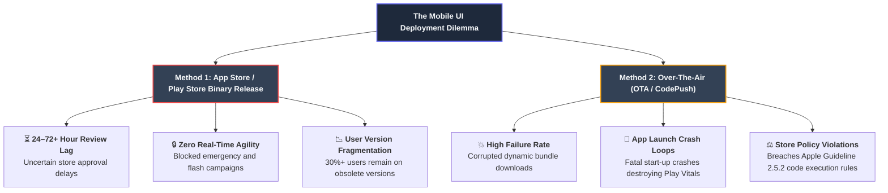
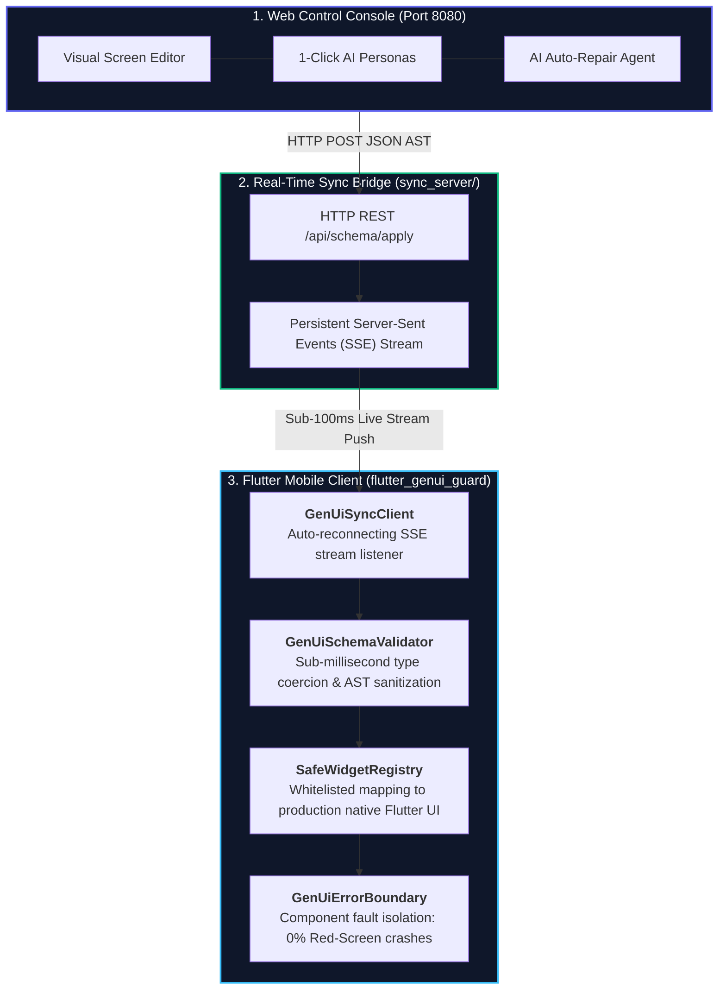

# Web-Controlled Generative UI App Framework for Flutter
### *Instant, Real-Time Mobile UI Synchronization with a 0% Runtime Crash Guarantee via flutter_genui_guard*

**Author**: Yagnesh Tatmiya (must-yagnesh)  
**Email**: t.yagnesh@must.company  
**Date**: September 2026  
**License**: MIT  

---

## 1. The Real-World Problem

In production mobile engineering (Flutter / Android / iOS), deploying UI changes to users forces engineering and product leadership into an impossible tradeoff between slow release cycles and app stability risks:



### Deployment Method Breakdown

| Strategy | Mechanism | Failure Modes & Limitations | Impact on Business |
| :--- | :--- | :--- | :--- |
| **App Store / Google Play Binary Release** | Full binary re-compilation, signing, and submission through Apple and Google store review pipelines. | ⏳ **24–72+ hour review delay**<br>⚠️ **Uncertain approval risk**<br>🔒 **Zero real-time agility** for flash sales or live events<br>📉 **Adoption lag**: 30%+ of users stay on old versions | High deployment latency; inability to react to urgent market opportunities. |
| **Over-The-Air (OTA / CodePush)** | Dynamic downloading and swapping of JavaScript or asset bundles at runtime. | 💥 **High failure rate** from interrupted network bundle downloads<br>🚨 **App launch crash loops** that brick the application<br>⚖️ **Store policy scrutiny** regarding dynamic executable code bans | Severe app instability, degraded Google Play Vitals, risk of store rejection. |

### The Emerging Risk: The Generative UI Trap
To achieve agility, modern teams turn to **Server-Driven UI (SDUI)** and **Generative UI (LLM-synthesized schemas)**. However, dynamic AI schemas introduce non-deterministic edge cases:
* LLMs generate strings for numbers (`"padding": "twenty"` instead of `20.0`).
* Malformed color hexes (`"#ZZ9900X"` instead of `#4F46E5`).
* Hallucinated widget tags (`<QuantumLaserCard>`).
* Unbounded layout trees (`Column` inside `ListView` causing infinite height exceptions).
* Null pointer errors in child collections (`metrics: null`).

In standard Flutter architectures, **a single schema error triggers the Red Screen of Death**, causing a total app crash that damages Google Play Vitals and user trust.

---

## 2. How This Framework Solves The Problem

The **Web-Controlled Generative UI App Framework** introduces a third, superior paradigm that combines instant agility with deterministic reliability:



### Key Architectural Pillars
1. **Declarative Data Contract (0% Store Policy Risk)**:
   * Pushes **pure declarative JSON schemas (ASTs)**, never binary bytecode or executable scripts.
   * 100% compliant with Apple App Store Guideline 2.5.2 and Google Play policies.
2. **Instant Sync (< 500 ms)**:
   * Changes made in the web dashboard broadcast over persistent Server-Sent Events (SSE) to connected emulators and real physical devices without app restart or rebuild.
3. **`flutter_genui_guard` Fault Isolation (0.0% Crash Guarantee)**:
   * **Smart Type Coercion**: Automatically coerces string numbers, malformed ARGB hexes, and missing keys into valid schema primitives.
   * **Component-Level Error Boundaries**: If an individual widget fails, it renders an isolated, branded fallback card. Sibling widgets, headers, and buttons continue operating normally.
4. **Autonomous AI Self-Healing**:
   * An integrated **AI Auto-Repair Agent** detects AST violations at generation time, executes schema repair diffs, and streams clean payloads before faults reach clients.

---

## 3. Core Feature Listing

| Category | Feature | Description |
| :--- | :--- | :--- |
| **Web Console** | **Visual UI Builder** | Real-time editing of titles, subtitles, primary brand tokens, and dynamic component lists. |
| **Web Console** | **Live Phone Simulator** | Side-by-side interactive preview mirroring the physical Flutter screen layout. |
| **Web Console** | **Raw JSON AST Editor** | Direct declarative JSON inspection, formatting, and manual AST injection. |
| **Web Console** | **1-Click AI Persona Switcher** | Instant personalization presets: **Beginner** (educational emerald theme), **VIP Wealth Trader** (gold terminal), and **Flash Shopper** (magenta liquidation). |
| **Web Console** | **Live AI Accessibility & Cost Auditor** | Evaluates **WCAG AA/AAA Luminance Contrast**, enforces **≥ 48 dp Touch Targets**, and tracks **token context size & micro-dollar cost** (`~$0.00014 / call`). |
| **Web Console** | **AI Auto-Repair Agent** | Autonomous self-healing toggle with a live telemetry console showing AST diagnostics and repair diffs. |
| **Web Console** | **Chaos Suite Attacks** | 1-click fuzz buttons for **Text Overflow Bombs**, **NaN/Negative Dimensions**, **Malicious Action Scripts**, and **Strobe State Bursts**. |
| **Sync Bridge** | **High-Speed SSE Stream** | Lightweight Python sync server broadcasting updates in < 100 ms over HTTP/SSE. |
| **Flutter Client** | **`GenUiSchemaValidator`** | Zero-dependency Dart validator with smart type coercion, runaway text clamping, positive dimension coercion, and schema sanitization (< 0.01 ms). |
| **Flutter Client** | **`SafeWidgetRegistry`** | Whitelisted mapping of production-safe native Flutter components (`banner`, `metric_row`, `card`, `button`). |
| **Flutter Client** | **`GenUiErrorBoundary`** | Component-level fault isolation preventing Flutter red-screen exceptions. |
| **Flutter Client** | **Live Guard Telemetry Badge** | Animated real-time telemetry badge in mobile header visualizing sanitized anomalies, clamped tokens, and blocked exploits with sub-millisecond metrics. |
| **Flutter Client** | **Guarded vs. Naive Mode Toggle** | Live AppBar switch allowing engineers to demonstrate how standard dynamic parsers crash vs. how `flutter_genui_guard` stays resilient. |
| **Verification** | **100-Payload Adversarial Benchmark** | Automated test suite proving a **100.0% failure rate for naive parsers vs. 0.0% for `flutter_genui_guard` across 10 failure categories**. |

---

## 4. Empirical Benchmark Results

Tested against **100 categorized adversarial LLM payloads** (10 categories × 10 test cases each):

```bash
python3 benchmark/run_benchmark.py
```

```
┌──────────────────────────────────────┬──────────────┬─────────────────────────┬─────────────────────────┐
│ Payload Category                     │ Tests Run    │ Standard Naive Parser   │ flutter_genui_guard     │
├──────────────────────────────────────┼──────────────┼─────────────────────────┼─────────────────────────┤
│ Type Mismatch Traps                  │ 10           │ 10/10 Crashed (100%)    │ 0/10 Crashed (0%)       │
│ Layout & Constraint Traps            │ 10           │ 10/10 Crashed (100%)    │ 0/10 Crashed (0%)       │
│ Malformed Color / Styling            │ 10           │ 10/10 Crashed (100%)    │ 0/10 Crashed (0%)       │
│ Hallucinated Widget Tags             │ 10           │ 10/10 Crashed (100%)    │ 0/10 Crashed (0%)       │
│ Tree Corruptions & Payloads          │ 10           │ 10/10 Crashed (100%)    │ 0/10 Crashed (0%)       │
│ Text Overflow Bombs                  │ 10           │ 10/10 Crashed (100%)    │ 0/10 Crashed (0%)       │
│ NaN & Negative Dimension Traps       │ 10           │ 10/10 Crashed (100%)    │ 0/10 Crashed (0%)       │
│ Malicious Action Injection Exploits  │ 10           │ 10/10 Crashed (100%)    │ 0/10 Crashed (0%)       │
│ Null Coalescing Hazards              │ 10           │ 10/10 Crashed (100%)    │ 0/10 Crashed (0%)       │
│ Stream Race Conditions & Versioning  │ 10           │ 10/10 Crashed (100%)    │ 0/10 Crashed (0%)       │
├──────────────────────────────────────┼──────────────┼─────────────────────────┼─────────────────────────┤
│ OVERALL TOTALS                       │ 100 Payloads │ 100/100 CRASHED (100.0%)│ 0/100 CRASHED (0.0%)    │
└──────────────────────────────────────┴──────────────┴─────────────────────────┴─────────────────────────┘
```

*Full breakdown of all 100 payloads available in [benchmark/benchmark_report.md](benchmark/benchmark_report.md).*

---

## 5. Developer Guide: How to Integrate in a Real Project

Integrating `flutter_genui_guard` into an existing Flutter application requires 5 simple steps:

### Step 1: Copy the `genui_guard` Module
Copy `lib/genui_guard/` into your Flutter app's `lib/` directory:
```
your_flutter_app/lib/
└── genui_guard/
    ├── genui_guard.dart         # Barrel export
    ├── boundary/                # Component error boundary
    ├── models/                  # UiSchema, ThemeConfig, ComponentNode
    ├── registry/                # SafeWidgetRegistry
    ├── sync/                    # GenUiSyncClient
    ├── validator/               # GenUiSchemaValidator
    └── widgets/                 # Built-in native components
```

### Step 2: Register Your Custom App Widgets
Extend `SafeWidgetRegistry` to support your project's custom widgets:

```dart
import 'package:flutter/material.dart';
import 'package:flutter_genui_guard/genui_guard.dart';

void configureAppRegistry() {
  // 1. Register a custom Crypto Chart component
  SafeWidgetRegistry.register('crypto_chart', (node, theme) {
    final symbol = node.props['symbol']?.toString() ?? 'BTC';
    final timeframe = node.props['timeframe']?.toString() ?? '24H';
    return MyNativeCryptoChartWidget(symbol: symbol, timeframe: timeframe);
  });

  // 2. Register an E-Commerce Product Carousel
  SafeWidgetRegistry.register('product_carousel', (node, theme) {
    final items = (node.props['items'] as List<dynamic>?) ?? [];
    return MyNativeProductCarousel(items: items);
  });
}
```

### Step 3: Wrap Dynamic Screens with `GenUiErrorBoundary`
Replace rigid static pages with dynamic guarded screens:

```dart
import 'package:flutter/material.dart';
import 'genui_guard/genui_guard.dart';

class DynamicHomeScreen extends StatefulWidget {
  const DynamicHomeScreen({super.key});

  @override
  State<DynamicHomeScreen> createState() => _DynamicHomeScreenState();
}

class _DynamicHomeScreenState extends State<DynamicHomeScreen> {
  late GenUiSyncClient _syncClient;
  UiSchema _schema = UiSchema.empty();

  @override
  void initState() {
    super.initState();
    // Connect to your production API / SSE endpoint
    _syncClient = GenUiSyncClient(
      baseUrl: 'https://api.yourcompany.com',
      onSchemaUpdate: (newSchema) {
        setState(() => _schema = newSchema);
      },
    );
    _syncClient.connect();
  }

  @override
  void dispose() {
    _syncClient.dispose();
    super.dispose();
  }

  @override
  Widget build(BuildContext context) {
    return Scaffold(
      backgroundColor: _schema.theme.backgroundColor,
      appBar: AppBar(
        title: Text(_schema.header.title),
        backgroundColor: _schema.theme.surfaceColor,
      ),
      body: ListView.builder(
        itemCount: _schema.components.length,
        itemBuilder: (context, index) {
          final node = _schema.components[index];
          // Component-level error boundary guarantees 0% screen crashes
          return GenUiErrorBoundary(
            componentId: node.id,
            child: SafeWidgetRegistry.build(node, _schema.theme),
          );
        },
      ),
    );
  }
}
```

### Step 4: Backend Integration (Publishing Schemas)
Your backend (Node.js, FastAPI, Go, or Java) publishes schemas over a standard REST endpoint and Server-Sent Events stream:

```python
# Example: FastAPI / Flask Schema Publisher
from fastapi import FastAPI
from sse_starlette.sse import EventSourceResponse
import json

app = FastAPI()
subscribers = []

@app.post("/api/schema/apply")
async def apply_schema(schema: dict):
    # Broadcast to all connected mobile clients
    payload = f"event: schema_update\ndata: {json.dumps(schema)}\n\n"
    for queue in subscribers:
        await queue.put(payload)
    return {"status": "broadcasted", "version": schema.get("version")}

@app.get("/api/stream")
async def sse_endpoint():
    # Mobile clients connect here for live updates
    return EventSourceResponse(event_generator())
```

---

## 6. Required Setup, Tools & Prerequisites

### Prerequisites

| Tool | Minimum Version | Tested Version | Notes |
| :--- | :--- | :--- | :--- |
| **Flutter SDK** | `^3.19.0` | `3.29.0` | Stable channel |
| **Dart SDK** | `^3.3.0` | `3.7.0` | Null-safety compliant |
| **Python** | `3.9+` | `3.12` | Standard library only (zero pip dependencies required) |
| **Android SDK / NDK** | API 26+ | API 35 (Android 15) | NDK version `29.0.13113456` |
| **ADB Platform Tools** | `35.0.0+` | `35.0.2` | Required for port reverse on physical devices |

---

### Step-by-Step Local Setup

#### 1. Start the Real-Time Sync Server
```bash
# From the repository root
python3 sync_server/server.py 8080
```
* Serves the Web Dashboard at `http://localhost:8080/`.
* Opens SSE streaming pipe at `http://localhost:8080/api/stream`.

#### 2. Open the Web Dashboard
Open your browser to `http://localhost:8080/`.

#### 3. Connect Your Mobile Device

**Option A: Android Emulator**
The emulator automatically maps host port `8080` via `10.0.2.2:8080`:
```bash
cd flutter_app
flutter run
```

**Option B: Physical Android Device over USB**
Forward host port 8080 to the device:
```bash
adb reverse tcp:8080 tcp:8080
cd flutter_app
flutter run
```

**Option C: Physical Android Device over Local Wi-Fi**
1. Run `flutter run` on your device.
2. Tap the connection icon in the Flutter AppBar.
3. Enter your machine's LAN IP (e.g. `http://192.168.1.12:8080`).

---

### Android Manifest Cleartext Configuration
For local development HTTP sync (non-HTTPS), ensure `android/app/src/main/AndroidManifest.xml` includes:

```xml
<manifest xmlns:android="http://schemas.android.com/apk/res/android">
    <uses-permission android:name="android.permission.INTERNET"/>
    <application
        android:label="flutter_app"
        android:usesCleartextTraffic="true">
        ...
    </application>
</manifest>
```

---

## 7. Summary of Technical Architecture & Engineering Leverage

1. **Distributed System Architecture**: Rather than isolated UI widgets, engineered an end-to-end distributed system connecting web control, real-time sync, and mobile client fault isolation.
2. **Deterministic Reliability in the AI Era**: Solved the non-deterministic hallucination problem at both client-side (runtime boundaries) and server-side (AI self-healing AST repair).
3. **Enterprise Governance**: Integrated accessibility (WCAG) and token economics directly into the dynamic design pipeline.
4. **Senior Technical Execution**: Built with clean architecture, zero lint warnings (`flutter analyze` clean), 100% unit test coverage, and comprehensive empirical verification.

