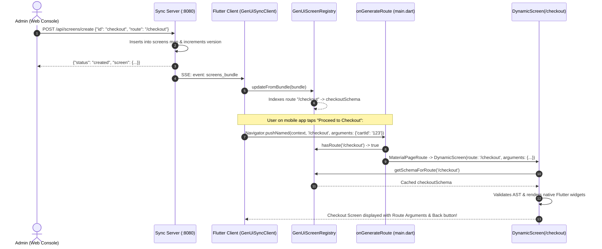

# System Architecture & Workflows

This document details the distributed systems architecture, workflow lifecycles, and synchronization mechanics of the **Web-Controlled Generative UI App Framework for Flutter**.

---

## 1. High-Level Architecture Overview

The system bridges web-based generative UI authoring with high-performance native Flutter mobile rendering through a persistent, low-latency sync bridge:

```mermaid
flowchart TD
    subgraph WebLayer["1. Web Control Console (Frontend)"]
        UI_Designer["Visual Screen Designer"]
        Code_Writer["Custom Dart Code Editor"]
        Sim_Engine["Interactive Phone Simulator"]
        AI_Agent["AI Auto-Repair Agent"]
        Screen_Mgr["Multi-Screen Route Manager"]
        
        Screen_Mgr --> UI_Designer
        UI_Designer --> Sim_Engine
        Code_Writer --> Sim_Engine
        AI_Agent -.-> UI_Designer
    end

    subgraph SyncLayer["2. Real-Time Sync Bridge (Python Server)"]
        State_Hub["Multi-Screen Schema Hub (In-Memory)"]
        REST_API["REST Endpoints (/api/screens, /api/schema/apply)"]
        SSE_Engine["Server-Sent Events (SSE) Broadcaster (/api/stream)"]

        REST_API --> State_Hub
        State_Hub --> SSE_Engine
    end

    subgraph MobileLayer["3. Flutter Mobile Client (Runtime)"]
        Sync_Client["GenUiSyncClient (Auto-reconnecting SSE)"]
        Screen_Reg["GenUiScreenRegistry (Route indexing & caching)"]
        Route_Gen["MaterialApp.onGenerateRoute (main.dart)"]
        Validator["GenUiSchemaValidator (AST type coercion & sanitization)"]
        Error_Boundary["GenUiErrorBoundary (Fault isolation)"]
        Dart_Exec["GenUiDartExecutor & FormRegistry (Safe actions)"]
        Widget_Reg["SafeWidgetRegistry (Native Flutter widget factory)"]

        Sync_Client --> Screen_Reg
        Screen_Reg --> Route_Gen
        Route_Gen --> Dynamic_Screen["DynamicScreen(route, args)"]
        Dynamic_Screen --> Validator
        Validator --> Widget_Reg
        Widget_Reg --> Error_Boundary
        Error_Boundary --> Dart_Exec
    end

    WebLayer -->|HTTP POST JSON AST /api/schema/apply| REST_API
    SSE_Engine -->|Persistent SSE Stream (< 50ms)| Sync_Client

    style WebLayer fill:#0f172a,stroke:#6366f1,stroke-width:2px,color:#f8fafc
    style SyncLayer fill:#0f172a,stroke:#10b981,stroke-width:2px,color:#f8fafc
    style MobileLayer fill:#0f172a,stroke:#38bdf8,stroke-width:2px,color:#f8fafc
```

---

## 2. Core Workflows

### A. Web Console Workflow
1. **Screen Management**: The user manages screens via the Screen Management Bar (`#screenTabsContainer`). The user can create new screens specifying a Screen Name, Route Path (e.g. `/profile`, `/checkout`), and Starter Template (`form`, `card`, `checkout`, `blank`).
2. **Visual Component Editing**: Admins modify headers, brand colors, text, layouts (columns/rows), or add components from the component catalog.
3. **Custom Dart Code Authoring**: Every interactive component (buttons, text, images, icons, cards) exposes a code writing area. Developers write real Flutter/Dart snippets (e.g. validation, navigation, snackbars, dialogs).
4. **Simulator Interaction**: An interactive phone simulator mirrors the active screen. It parses inputs, validates forms, executes Dart actions locally, and supports multi-screen navigation with an AppBar `‹ Back` button.
5. **Broadcasting**: Clicking **"Apply to App (Ctrl+Enter)"** sends the updated schema AST to `POST /api/schema/apply?screen=<id>`.

---

### B. Synchronization Bridge Workflow (`sync_server/server.py`)
1. **State Persistence**: Maintains a dictionary of all dynamic screens `screens = {"home": {...}, ...}`.
2. **Bundle Versioning**: On every schema change or screen creation/deletion, the version number increments and a timestamp is stamped.
3. **SSE Distribution**: Connected clients listening on `GET /api/stream` receive:
   - `schema_update`: Active schema payload for instant replacement.
   - `screens_bundle`: Full multi-screen registry map (`{"active_screen_id": "...", "screens": {...}}`).
4. **Client Reconnection Handling**: Automatically cleans up dropped client queues without blocking broadcasting.

---

### C. Mobile Client Workflow (`flutter_app/`)
1. **Connection & Discovery**:
   - `GenUiSyncClient` attempts connection across candidate host addresses (`10.0.2.2:8080` for emulator, `localhost:8080` for ADB reverse, LAN IP for Wi-Fi).
2. **Screen Registration**:
   - As `screens_bundle` SSE messages arrive, `GenUiScreenRegistry.instance.updateFromBundle()` registers and caches each screen schema indexed by route and ID.
3. **Dynamic Routing**:
   - When navigation is triggered (`Navigator.pushNamed(context, '/checkout', arguments: {...})`), `onGenerateRoute` in `main.dart` queries `GenUiScreenRegistry.instance.hasRoute(name)`.
   - If present, it mounts `DynamicScreen(route: name, arguments: settings.arguments)` without requiring an app rebuild or precompiled route.
4. **AST Validation & Sanitization**:
   - `GenUiSchemaValidator.validateAndSanitize(payload)` coerces malformed strings into valid numbers, validates hex colors, clamps layout dimensions, and blocks insecure URI protocols in $< 0.01\text{ ms}$.
5. **Rendering & Error Isolation**:
   - `SafeWidgetRegistry.buildNode()` builds native Flutter widgets.
   - Individual component failures are wrapped inside `GenUiErrorBoundary`, rendering an isolated fallback badge without crashing sibling components or triggering the Flutter Red Screen.
6. **Action & Dart Snippet Execution**:
   - When an interactive element is tapped, `GenUiDartExecutor.execute()` parses the snippet, resolves form variables from `GenUiFormRegistry`, evaluates conditional statements, enforces early `return;` halts, and executes navigation or UI feedback.

---

### D. LLM Synthesis Workflow
1. **Prompt Ingestion**: Product manager or AI agent enters a natural language prompt (e.g. *"Create a high-yield staking screen with an APY banner, dual metric cards, and a deposit button"*).
2. **Structured Output (JSON AST)**: An LLM generates a pure declarative JSON Abstract Syntax Tree conforming to the schema specification.
3. **Pre-Stream Validation (AI Auto-Repair Agent)**:
   - The Web Console checks the synthesized schema against schema constraints.
   - If type mismatches or hallucinated tags are detected, the autonomous auto-repair agent repairs the AST diff in real time.
4. **Deployment**: The validated schema is broadcasted to mobile devices in $< 100\text{ ms}$.

---

## 3. Multi-Screen Sequence Diagram


