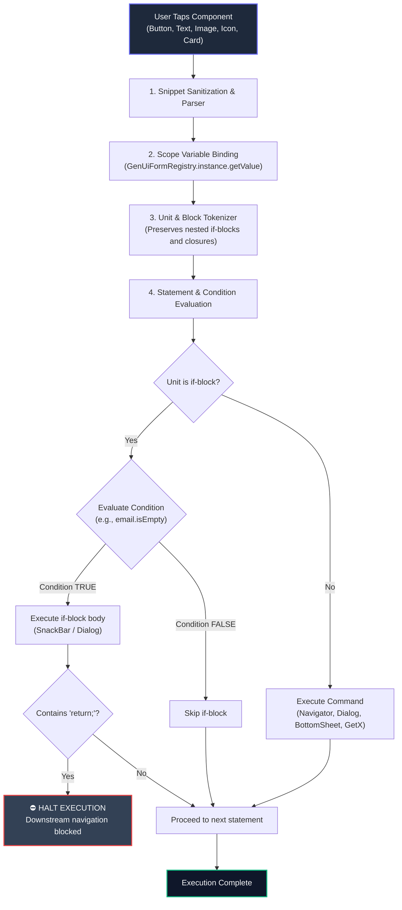

# Custom Dart Execution Engine (`GenUiDartExecutor`)

This document specifies the architecture, execution model, syntax specifications, and security model of the **`GenUiDartExecutor`** safe execution engine in `flutter_genui_guard`.

---

## 1. Executive Summary & Problem Context

In traditional Flutter development, dynamic behavior (e.g. form validation, dialog triggers, route transitions) requires re-compilation and re-publishing of Dart binaries.

To allow product managers, designers, and LLMs to define custom action logic directly from a Web Console without risking app crashes or violating **Apple App Store Guideline 2.5.2** (which prohibits downloading and executing dynamic machine code or unvetted scripts), `flutter_genui_guard` includes **`GenUiDartExecutor`**.

`GenUiDartExecutor` is a **sandboxed, deterministic Dart AST action interpreter**. It executes real Flutter/Dart syntax within a secure, controlled scope without using dangerous runtime `eval` or dynamic bytecode compilation.

---

## 2. Execution Pipeline



---

## 3. Supported Dart Syntax & Grammar

### A. Dynamic Form Value Extraction
Bind to user input fields in any textfield, switch, or checkbox:
```dart
final email = GenUiFormRegistry.instance.getValue('email');
final password = GenUiFormRegistry.instance.getValue('password');
final agreed = GenUiFormRegistry.instance.getValue('terms');
```

### B. Conditional Validation & Early Return
`GenUiDartExecutor` evaluates conditional expressions. When `return;` is encountered inside a triggered block, execution halts immediately:
```dart
final email = GenUiFormRegistry.instance.getValue('email');

if (email.isEmpty || !email.contains('@')) {
  ScaffoldMessenger.of(context).showSnackBar(
    SnackBar(
      content: Text('Please enter a valid work email!'),
      backgroundColor: Color(0xFFEF4444),
    ),
  );
  return; // ⛔ HALTS: Downstream navigation will NOT execute
}

// Navigation executes only if condition passed
Navigator.pushNamed(
  context,
  '/dashboard',
  arguments: {'user_email': email},
);
```

### C. Standard Navigation with Dynamic Arguments
Supports both native Flutter `Navigator` and `GetX` routing semantics:

#### Flutter Navigator:
```dart
Navigator.pushNamed(
  context,
  '/checkout',
  arguments: {'order_id': 'ORD-9021', 'total': 149.99},
);
```

#### Go Back / Pop:
```dart
Navigator.pop(context);
```

#### GetX Navigation:
```dart
Get.toNamed('/profile', arguments: {'tier': 'VIP'});
```

### D. Material Dialogs & Modals
```dart
showDialog(
  context: context,
  builder: (ctx) => AlertDialog(
    title: const Text('Confirm Purchase'),
    content: const Text('Charge \$49.00 to your saved card?'),
    actions: [
      TextButton(onPressed: () => Navigator.pop(ctx), child: const Text('Cancel')),
      ElevatedButton(onPressed: () => Navigator.pop(ctx), child: const Text('Confirm')),
    ],
  ),
);
```

### E. Custom Bottom Sheets
```dart
showModalBottomSheet(
  context: context,
  isScrollControlled: true,
  backgroundColor: Colors.transparent,
  builder: (context) => const CustomDemoBottomSheet(),
);
```

### F. SnackBars with Variable Interpolation
```dart
final email = GenUiFormRegistry.instance.getValue('email');

ScaffoldMessenger.of(context).showSnackBar(
  SnackBar(
    content: Text('Verification sent to $email'),
    backgroundColor: const Color(0xFF10B981),
  ),
);
```

---

## 4. Fault Tolerance & Safety Guarantees

1. **Zero-Crash Exception Isolation**: Every execution runs within a protective try-catch boundary. If an author inputs invalid Dart syntax, `GenUiDartExecutor` safely logs a warning and falls back gracefully without crashing the UI thread.
2. **Deterministic String Interpolation**: `$variable` expressions are sanitized to prevent injection attacks or null pointer exceptions.
3. **Strict Sandboxing**: The executor does not expose `dart:io`, `dart:ffi`, filesystem access, reflection, or network sockets. Only vetted Flutter UI interactions and navigation routes are accessible.
