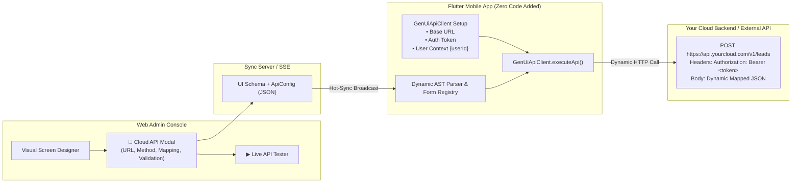

# Declarative Cloud API & Dynamic Form Integration Guide
### *Zero-Code Mobile Form Submission, Endpoint Binding, Auth Injection, and Screen Archetypes*

**Author**: Yagnesh Tatmiya (must-yagnesh)  
**Framework**: `flutter_genui_guard`  
**Applicable Stack**: Flutter 3.29+ / Dart 3.7+ / Python 3.9+ / Node.js & Modern Web

---

## 1. Executive Architecture & Core Concept

Traditionally, building forms and connecting mobile apps to backend APIs required writing redundant Flutter code: controllers, state models, HTTP repositories, validation logic, and error handlers for every new screen.

The `flutter_genui_guard` framework replaces all static mobile API code with a **100% Declarative Cloud API Engine**:



### The Zero-Code Guarantee
> [!IMPORTANT]
> **No API-related code is ever added or modified in the Flutter app** when admins create new screens, design new forms, change field names, or bind new endpoints. Everything is parsed dynamically from the declarative JSON schema at runtime.

### Clean Separation of Concerns
1. **Flutter Mobile App**: Manages runtime environment concerns:
   - Sets the global domain / Base URL (`https://api.yourcompany.com`).
   - Injects the active user's session (`Authorization: Bearer <token>`).
   - Supplies the active user ID and contextual variables (`userId`, `tenantId`).
2. **Web Admin Console**: Manages business logic and screen layout:
   - Configures endpoint paths (`/v1/contact`, `/api/tickets`, `/users/{userId}/profile`).
   - Maps screen inputs to backend JSON keys (`input_name` ➔ `fullName`).
   - Sets input validation rules (`required`, `email`, `min_length`).
   - Defines outcomes (confirmation popups, SnackBars, route navigation).

---

## 2. Web Admin Console: Configuring APIs & Mapping Fields

The Web Admin Console provides a visual configuration modal for any screen or button.

### Step 1: Open the API Configuration Modal
- **Screen-Level API**: Click **`🔌 Screen API`** on the top toolbar to configure an API that can be triggered from anywhere on the active screen.
- **Button-Level API**: Select any **Button** in the visual designer or component tree and click **`🔌 Configure API`**.

---

### Step 2: Choose HTTP Method & Endpoint URL
In the **Endpoint & Method** section:
- **HTTP Method**: Choose `POST`, `GET`, `PUT`, `PATCH`, or `DELETE`.
- **API URL / Endpoint**:
  - **Relative Path (Recommended for internal APIs)**: e.g., `/v1/contact-us`, `/api/leads`, `/users/{userId}/profile`. Flutter automatically prepends your mobile app's configured Base URL.
  - **Absolute URL (For external cloud/third-party services)**: e.g., `https://hooks.slack.com/services/...` or `https://api.airtable.com/v0/...`. Flutter detects `http://` or `https://` and calls it directly without prepending the Base URL.
  - **Path Variables**: You can include placeholders in curly braces like `{userId}` or `{orderId}`. Flutter automatically replaces them with active user or payload values.

---

### Step 3: Configure Request Headers
- Default headers (`Content-Type: application/json`, `Accept: application/json`) and `Authorization: Bearer <token>` are attached automatically by Flutter.
- To attach custom headers (e.g. `X-API-Key`, `X-Webhook-Secret`), click **`+ Add Header`** in the Headers table:

| Header Name | Header Value | Description |
| :--- | :--- | :--- |
| `X-API-Key` | `live_sec_99384821` | Custom cloud authentication key |
| `X-Client-Version` | `2.1.0` | Custom client identification |

---

### Step 4: Map Screen Fields to API JSON Keys
In the **Request Body & Field Mapping** section, define how form inputs map to your backend's expected JSON payload:

1. Click **`⚡ Auto-Map All Screen Inputs`**: The console automatically scans all interactive inputs on the active screen (Textfields, Checkboxes, Switches, Dropdowns) and adds them to the mapping table.
2. Adjust the **API Payload Key**:
   - For example, if the screen component ID is `input_contact_email`, you can set the API key to `email` or `userEmailAddress`.
3. Add custom mappings manually with **`+ Add Field Mapping`** by selecting the input from the dropdown and naming the backend key.

#### Example Field Mapping Table:
| Screen Input Component | Backend API JSON Key | Example Transmitted Value |
| :--- | :--- | :--- |
| `input_full_name` (Textfield) | `fullName` | `"Sarah Jenkins"` |
| `input_email` (Textfield) | `email` | `"sarah@example.com"` |
| `input_phone` (Textfield) | `phoneNumber` | `"+1 555-0199"` |
| `input_inquiry` (Textarea) | `message` | `"Interested in enterprise tier"` |
| `check_terms` (Checkbox) | `acceptedTerms` | `true` |

---

### Step 5: Add Static Constant Parameters
If your cloud backend requires constant parameters that are not entered by the user (such as `source`, `form_type`, `environment`), add them under **Static Parameters**:

| Static Parameter Key | Static Value |
| :--- | :--- |
| `source` | `"flutter_mobile_app"` |
| `department` | `"sales_enterprise"` |
| `environment` | `"production"` |

---

### Step 6: Real-Time Outgoing Payload Preview
As you adjust field mappings and static parameters, the **Outgoing JSON Preview** box in the modal updates in real time:

```json
{
  "fullName": "John Doe",
  "email": "john@example.com",
  "phoneNumber": "+1 (555) 019-2834",
  "message": "Hello, I would like more information.",
  "acceptedTerms": true,
  "source": "flutter_mobile_app",
  "department": "sales_enterprise"
}
```

---

### Step 7: Configure Declarative Validation Rules
On each field component in the Visual Designer, set client-side validation rules:
- **`Required`**: Blocks API execution if the input is left empty.
- **`Input Type / Format`**:
  - `email`: Validates standard email regex (`name@domain.com`).
  - `phone`: Validates international phone format.
  - `number`: Validates integer or decimal numeric values.
- **`Min Length`**: Ensures minimum character count (e.g., min 8 characters for passwords, min 20 characters for feedback).
- **`Custom Error Message`**: The exact error message displayed to the user if validation fails.

---

### Step 8: Define Success & Error Outcomes
Under **Outcome Action**:
- **Confirmation Dialog**: Displays a modern modal dialog upon successful HTTP 200/201 response with custom title, message, and button text.
- **Floating SnackBar**: Displays a green success banner at the bottom of the screen.
- **Route Navigation**: Automatically navigates the user to another dynamic screen route upon success (e.g. `/thank-you` or `/dashboard`).
- **Error Feedback**: If the cloud API returns 400, 401, 422, or 500, a red error SnackBar is displayed with the server's error message or a user-configured fallback.

---

### Step 9: In-Browser Live API Test Runner
Before deploying changes to mobile users, test your cloud API directly from the Web Console:
1. Scroll to the **Direct Cloud API Test Runner** card inside the modal.
2. Click **`▶ Send Test Request Now`**.
3. The dashboard executes the HTTP call, displays the HTTP status badge (`200 OK`, `404 Not Found`, etc.), shows the round-trip latency (`42ms`), and formats the raw JSON response.
4. Click **`💾 Save & Bind API`**. The schema updates and instantly hot-syncs to all connected Flutter devices.

---

### Step 10: Screen Data Source (GET API) Authorization & Real Project API Inspection
When binding a dynamic screen to a live **Data Source (GET / Fetch)** that requires authentication (e.g. JWT Bearer token or API key):
1. In the **Screen Data Source (GET / Fetch & Binding)** tab, open **Section 2: AUTHORIZATION & REQUEST HEADERS**.
2. Select your authentication mode:
   - **`🔑 Bearer Token`**: Enter your JWT / OAuth token. It is automatically formatted and transmitted as `Authorization: Bearer <token>`.
   - **`🛡️ API Key`**: Specify the header name (defaults to `X-API-Key`, or choose `api-key`, `Authorization`, etc.) and enter your secret key.
   - **`⚙️ Custom Headers`**: Add any arbitrary headers (`X-Tenant-ID`, `Client-Secret`, etc.) in the All Request Headers table.
3. Click **`⚡ Fetch & Inspect API Data`**:
   - The web console issues an authenticated request directly to your project API.
   - If direct browser fetch is blocked by CORS, it automatically falls back through the Sync Server CORS proxy with all authentication headers safely forwarded.
   - If unauthorized (HTTP 401/403), the console displays an actionable error message and explanation.
   - On HTTP 200 OK, the console shows the response structure and dynamic binding tokens.
4. Click **`💾 Save & Bind API`**: All configured headers are saved into `activeSchema.data_source.headers` and dispatched to the mobile app for dynamic data loading.

---

## 3. Flutter Mobile Integration: Base URL, Auth Token, & User ID

The Flutter app uses `GenUiApiClient` to govern all API communications.

### Core API Methods:
| Method | Description |
| :--- | :--- |
| `GenUiApiClient.setBaseUrl(url)` | Sets the root domain (e.g. `https://api.myproject.com`). Relative endpoints prepended automatically. |
| `GenUiApiClient.setAuthToken(token)` | Sets the active JWT / OAuth token. Injected as `Authorization: Bearer <token>`. |
| `GenUiApiClient.setAuthTokenProvider(fn)` | Callback for dynamic token fetching (e.g. Firebase Auth auto-refresh). |
| `GenUiApiClient.setUserContext(map)` | Key-value store for user properties; interpolates path variables like `{userId}`. |
| `GenUiApiClient.setDefaultHeaders(map)` | Injects global headers into every request (e.g. `X-App-Version`, `X-Platform`). |
| `GenUiApiClient.clearSession()` | Clears auth tokens and user context on logout. |

---

### Real-World Flutter Implementation Patterns

#### Pattern 1: App Initialization (`main.dart`)
Set up the production base URL and restore any stored session during app launch:

```dart
// lib/main.dart
import 'package:flutter/material.dart';
import 'package:flutter_secure_storage/flutter_secure_storage.dart';
import 'package:flutter_genui_guard/genui_guard/sync/api_client.dart';
import 'app.dart';

void main() async {
  WidgetsFlutterBinding.ensureInitialized();

  // 1. Configure the Cloud Base URL (Staging or Production)
  const isProduction = bool.fromEnvironment('dart.vm.product');
  GenUiApiClient.setBaseUrl(
    isProduction 
      ? 'https://api.mycompany.com' 
      : 'https://staging-api.mycompany.com',
  );

  // 2. Set Default Application Headers
  GenUiApiClient.setDefaultHeaders({
    'X-App-Version': '2.4.0',
    'X-Platform': 'flutter-mobile',
  });

  // 3. Restore persisted user session if available
  const storage = FlutterSecureStorage();
  final token = await storage.read(key: 'auth_token');
  final userId = await storage.read(key: 'user_id');

  if (token != null && userId != null) {
    GenUiApiClient.setAuthToken(token);
    GenUiApiClient.setUserContext({
      'userId': userId,
      'tenantId': await storage.read(key: 'tenant_id') ?? 'default',
    });
  }

  runApp(const MyApp());
}
```

---

#### Pattern 2: Authentication Service (Login, Register & Logout)
Attach the user token immediately upon login and clear it on logout:

```dart
// lib/services/auth_service.dart
import 'dart:convert';
import 'package:http/http.dart' as http;
import 'package:flutter_secure_storage/flutter_secure_storage.dart';
import 'package:flutter_genui_guard/genui_guard/sync/api_client.dart';

class AuthService {
  final _storage = const FlutterSecureStorage();

  /// Call upon successful user sign-in
  Future<bool> login(String email, String password) async {
    try {
      final response = await http.post(
        Uri.parse('https://api.mycompany.com/v1/auth/login'),
        headers: {'Content-Type': 'application/json'},
        body: jsonEncode({'email': email, 'password': password}),
      );

      if (response.statusCode == 200) {
        final data = jsonDecode(response.body);
        final token = data['token'] as String;
        final user = data['user'] as Map<String, dynamic>;

        // 1. Pass Token & User ID to GenUi Dynamic API Engine
        GenUiApiClient.setAuthToken(token);
        GenUiApiClient.setUserContext({
          'userId': user['id'],
          'email': user['email'],
          'role': user['role'],
        });

        // 2. Save securely to device storage
        await _storage.write(key: 'auth_token', value: token);
        await _storage.write(key: 'user_id', value: user['id']);

        return true;
      }
      return false;
    } catch (_) {
      return false;
    }
  }

  /// Call on user sign-out
  Future<void> logout() async {
    // Clears auth token, token provider, and user context
    GenUiApiClient.clearSession();
    await _storage.deleteAll();
  }
}
```

---

#### Pattern 3: Dynamic Token Provider (Firebase Auth / OAuth / Token Refresh)
When using Firebase Auth, AWS Cognito, or OAuth with automatic token refreshing, register a **Token Provider** callback so requests always get a valid, fresh token:

```dart
// Works seamlessly with Firebase Authentication:
import 'package:firebase_auth/firebase_auth.dart';
import 'package:flutter_genui_guard/genui_guard/sync/api_client.dart';

void setupFirebaseAuthTokenProvider() {
  GenUiApiClient.setAuthTokenProvider(() {
    final user = FirebaseAuth.instance.currentUser;
    // Returns current active token or null if logged out
    return user?.getIdToken();
  });

  // Listen to user ID changes
  FirebaseAuth.instance.authStateChanges().listen((user) {
    if (user != null) {
      GenUiApiClient.setUserContext({'userId': user.uid, 'email': user.email});
    } else {
      GenUiApiClient.clearSession();
    }
  });
}
```

---

#### Pattern 4: State Management Integration (Riverpod / BLoC)
If your app uses Riverpod or BLoC, update `GenUiApiClient` in your auth state listener:

```dart
// Riverpod Example
ref.listen<AuthState>(authNotifierProvider, (previous, next) {
  if (next.isAuthenticated) {
    GenUiApiClient.setAuthToken(next.token);
    GenUiApiClient.setUserContext({
      'userId': next.user.id,
      'role': next.user.role,
    });
  } else {
    GenUiApiClient.clearSession();
  }
});
```

---

## 4. Supported Screen Archetypes & Real-World Use Cases

The declarative API architecture supports any screen layout and any RESTful interaction pattern without changing Flutter code:

### 1. Contact Us & Sales Inquiries
- **UI Components**: Name, Email, Phone number, Subject dropdown, Message textarea, Terms checkbox, Submit button.
- **API Endpoint**: `POST /v1/inquiries` or `POST /api/leads`
- **Field Mapping**:
  - `input_name` ➔ `fullName`
  - `input_email` ➔ `email`
  - `input_phone` ➔ `phone`
  - `input_message` ➔ `inquiryMessage`
- **Static Body**: `{"lead_source": "mobile_app", "campaign": "fall_2026"}`
- **Outcome**: Modern confirmation dialog: *"Thank you! Our sales team will reach out within 24 hours."*

---

### 2. Customer Feedback & Product Ratings
- **UI Components**: Star Rating bar, Category chips, Multi-line comment box, Anonymous switch, Submit button.
- **API Endpoint**: `POST /api/v1/feedback`
- **Field Mapping**:
  - `rating_stars` ➔ `score`
  - `input_category` ➔ `category`
  - `input_comments` ➔ `reviewText`
  - `switch_anonymous` ➔ `isAnonymous`
- **Outcome**: Floating green SnackBar: *"Your feedback helps us improve!"*

---

### 3. User Profile & Settings Management
- **UI Components**: Full name textfield, Bio, Notifications toggle switch, Dark mode switch, Save button.
- **API Endpoint**: `PUT /api/users/{userId}/profile`
- **Path Resolution**: The `{userId}` in the URL is replaced dynamically by Flutter using the active user context.
- **Field Mapping**:
  - `input_display_name` ➔ `displayName`
  - `input_bio` ➔ `bio`
  - `switch_notifications` ➔ `notificationsEnabled`
- **Outcome**: Floating SnackBar: *"Profile updated successfully."*

---

### 4. Support Ticket Submission & Help Desk
- **UI Components**: Issue category dropdown, Priority selector, Order ID input, Detailed issue description, Submit button.
- **API Endpoint**: `POST /api/support/tickets`
- **Field Mapping**:
  - `select_category` ➔ `category`
  - `select_priority` ➔ `priority`
  - `input_order_id` ➔ `orderReference`
  - `input_description` ➔ `ticketBody`
- **Static Body**: `{"client": "flutter_mobile", "priority_tier": "standard"}`
- **Outcome**: Confirmation modal with generated ticket reference.

---

### 5. Multi-Question Assessment / Survey
- **UI Components**: Radio button groups, Checkbox lists, Slider ratings, Next/Submit buttons.
- **API Endpoint**: `POST /api/surveys/q3-customer-pulse/responses`
- **Field Mapping**:
  - `radio_satisfaction` ➔ `npsScore`
  - `checkbox_features_used` ➔ `selectedFeatures`
  - `input_recommendation` ➔ `qualitativeFeedback`
- **Outcome**: Navigation to `/survey-complete` screen route.

---

### 6. Service Appointment / Reservation Booking
- **UI Components**: Service selection dropdown, Date/time text input, Party size stepper, Special requests input, Confirm button.
- **API Endpoint**: `POST /api/v1/bookings`
- **Field Mapping**:
  - `select_service` ➔ `serviceId`
  - `input_date` ➔ `bookingDate`
  - `input_guests` ➔ `partySize`
  - `input_notes` ➔ `specialRequests`
- **Outcome**: Confirmation dialog with booking summary and date.

---

### 7. Event RSVP / Conference Registration
- **UI Components**: Attendee name, Company, Dietary preferences dropdown, Badge name input, Register button.
- **API Endpoint**: `POST /api/events/{eventId}/register`
- **Static Body**: `{"ticket_tier": "general_admission"}`
- **Outcome**: Success dialog with pass confirmation.

---

### 8. Newsletter & Marketing Opt-In
- **UI Components**: Email textfield, Topic preference checkboxes, Subscribe button.
- **API Endpoint**: `POST /api/newsletter/subscribe`
- **Field Mapping**:
  - `input_email` ➔ `subscriberEmail`
  - `check_product_updates` ➔ `wantsProductUpdates`
- **Outcome**: Green SnackBar: *"You're subscribed! Check your inbox."*

---

### 9. Account Deletion / Resource Cancellation
- **UI Components**: Reason dropdown, Confirmation checkbox ("I understand this cannot be undone"), Delete button.
- **API Endpoint**: `DELETE /api/users/{userId}`
- **Field Mapping**:
  - `select_reason` ➔ `deletionReason`
  - `check_confirm` ➔ `confirmed`
- **Outcome**: Clears Flutter session and navigates to `/login` route.

---

## 5. Supported API Types & Backend Compatibility

The dynamic engine makes standard HTTP requests compliant with RFC 7231 and works with any modern backend architecture:

| Backend Type | Compatibility | Notes & Setup |
| :--- | :---: | :--- |
| **Custom REST APIs** (FastAPI, Express, Django, NestJS, Go, Spring Boot, Laravel) | ✅ **100% Native** | Use relative paths (e.g. `/v1/leads`). Set `GenUiApiClient.setBaseUrl(...)` in Flutter. |
| **Third-Party Webhooks** (Slack, Zapier, Make.com, n8n, Discord) | ✅ **100% Native** | Use absolute URL (e.g. `https://hooks.slack.com/...`). No base URL needed. |
| **Serverless & Edge Functions** (AWS Lambda, Google Cloud Functions, Supabase Edge) | ✅ **100% Native** | Works with standard HTTP triggers; accepts mapped JSON payload. |
| **Low-Code / Headless CMS** (Airtable, Notion, Strapi, Directus, Contentful) | ✅ **100% Native** | Supply custom `Authorization: Bearer` or `apiKey` in headers table. |
| **GraphQL Endpoints** | ✅ **Supported** | Method: `POST`. Static parameter: `query: "mutation { ... }"`. Field mapping maps to `variables`. |

---

## 6. Error Handling & 0% Runtime Crash Guarantee

The dynamic client is built with defensive error handling to prevent mobile application crashes under all conditions:

1. **Pre-Flight Validation**: Form rules are validated locally in memory before network transmission. If an input is invalid or missing, execution halts cleanly and informs the user. No malformed payloads leave the device.
2. **Graceful HTTP Failures**: Non-2xx responses (400 Bad Request, 401 Unauthorized, 422 Unprocessable, 500 Server Error) do **not** crash the app. The client parses the error message from the server response (or uses the configured fallback message) and renders a user-friendly error SnackBar.
3. **Network Timeouts & Offline Resilience**: Requests default to a 10-second timeout. If the device loses internet connectivity or DNS fails, the exception is caught, logged safely via `debugPrint`, and displayed gracefully to the user without crashing the Flutter widget tree.
4. **URL Path Sanitization**: Path variables (`{userId}`) are URL-encoded (`Uri.encodeComponent`) to prevent path injection or malformed URI errors.

---

## 7. Quick Reference Cheat Sheet

### Flutter Setup (Once in your app lifetime)
```dart
import 'package:flutter_genui_guard/genui_guard/sync/api_client.dart';

// In main.dart or app init:
GenUiApiClient.setBaseUrl('https://api.mycloud.com');

// When user logs in:
GenUiApiClient.setAuthToken(jwtToken);
GenUiApiClient.setUserContext({'userId': user.id});

// When user logs out:
GenUiApiClient.clearSession();
```

### JSON Schema `ApiConfig` Specification
```json
{
  "api_config": {
    "url": "/v1/contact",
    "method": "POST",
    "headers": {
      "X-Custom-Source": "mobile"
    },
    "body_mapping": {
      "fullName": "input_name",
      "email": "input_email",
      "message": "input_msg"
    },
    "static_body": {
      "form_type": "inquiry",
      "tenant_id": "default"
    },
    "outcome": {
      "type": "dialog",
      "title": "Success",
      "message": "We have received your message!",
      "button_text": "OK"
    },
    "error_outcome": {
      "type": "snackbar",
      "message": "Submission failed. Please try again."
    }
  }
}
```
