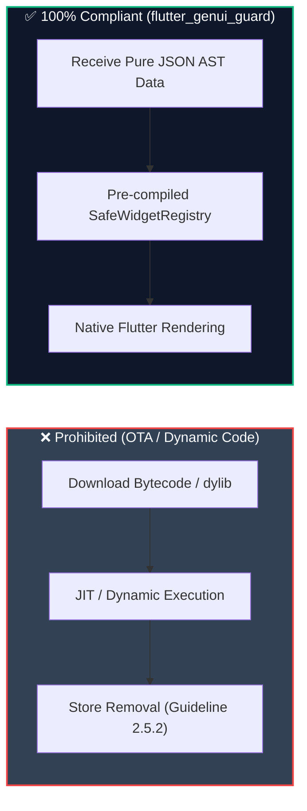

# Security, Store Compliance & Enterprise Governance

This document covers the security architecture, mobile store policy compliance (Apple & Google), accessibility standards, and token economics of the **Web-Controlled Generative UI App Framework**.

---

## 1. App Store & Google Play Store Policy Compliance

### The Problem: Store Rejection Risks from Over-The-Air (OTA) Code
Traditional dynamic code frameworks (e.g. dynamic patching, JS-engine injection, dynamic `.so` / `.dylib` loading) regularly face app rejection or removal under:
* **Apple App Store Review Guideline 2.5.2**: *"Apps must be self-contained and may not download, install, or execute code that introduces new features or functionality."*
* **Google Play Device and Network Abuse Policy**: Prohibits downloading executable code (dex, bytecode, native code) from external sources.

### How `flutter_genui_guard` Complies 100%
The framework operates as a **declarative data renderer (Server-Driven UI / SDUI)** rather than a code execution vector:

1. **Pure Declarative Data Contract**: The sync server only transmits JSON data representations of standard UI layouts. No machine code, bytecode, or dynamically loaded libraries are transmitted.
2. **Deterministic Pre-compiled Widgets**: All visual components are pre-compiled within the Flutter application binary. The schema simply instructs existing native widgets where to position themselves.
3. **Sandboxed Action Dispatching**: `GenUiDartExecutor` does not employ `dart:mirrors`, dynamic `eval`, or external interpreters. It interprets high-level UI intents (`showSnackBar`, `Navigator.pushNamed`) using pre-vetted Flutter APIs.

---

## 2. Sandboxing & Input Sanitization

1. **XSS & Injection Immunity**:
   Flutter’s rendering pipeline treats text nodes as raw graphical primitives (`TextPainter` / Skia / Impeller canvas draws). There is no HTML DOM, avoiding Cross-Site Scripting (XSS) risks.
2. **URI Protocol Whitelisting**:
   Image loaders strictly whitelist `https://` and `http://` protocols. Protocols such as `file://`, `content://`, `javascript:`, or `data:` are blocked, preventing local device file exfiltration.
3. **No Filesystem / Process Access**:
   `GenUiDartExecutor` has zero access to `dart:io`, device storage, camera, contacts, or platform channels unless explicitly exposed through native app handlers.

---

## 3. WCAG AA/AAA Accessibility Audit

The Web Console features a live **AI Accessibility Auditor** that analyzes schemas before deployment:
* **Luminance Contrast**: Validates text against background colors using the W3C Relative Luminance Formula:
  $$(\text{Ratio} = \frac{L_1 + 0.05}{L_2 + 0.05} \ge 4.5:1)$$
  Flags contrast warnings for regular text failing $4.5:1$ and large text failing $3.0:1$.
* **Touch Target Sizing**: Enforces Apple HIG and Android Material guidelines requiring minimum tap areas of **$48 \times 48\text{ dp}$** for interactive buttons and icons.

---

## 4. LLM Token Economics & Cost Optimization

To minimize LLM operational costs when generating screens programmatically:
* **Compact AST Notation**: The JSON schema is optimized for minimal token context, averaging **250–400 tokens per full screen** (~1.2 KB raw JSON).
* **Cost per Screen Generation**: At standard LLM API pricing (e.g. Gemini 1.5 Flash / GPT-4o-mini), generating or modifying a screen costs **$\approx \$0.00014\text{ per request}$**.
* **Client-Side Caching**: Once received by `GenUiScreenRegistry`, screens are cached in memory, eliminating redundant network calls.
